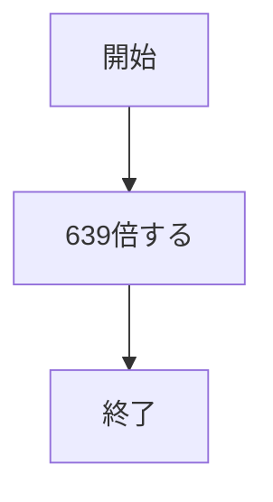
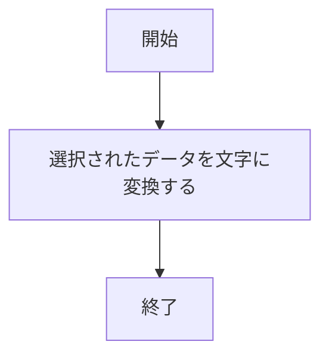

# webpro_06
    2024/10/29
## 数値計算のプログラムについて
## ファイル一覧

ファイル名|説明
-|-
app5.js|プログラム本体
puclic/639.html|数値計算の開始画面
puclic/639.ejs|数値計算の終了画面

##　使用方法
1. app5.js を起動する
1. Webブラウザでlocalhost:8080/public/639.htmlにアクセスする
1. 自分の手を入力する

## 予約のプログラムについて
## ファイル一覧

ファイル名|説明
-|-
app5.js|プログラム本体
puclic/reservation.html|予約の開始画面
puclic/reservation.ejs|6予約の終了画面

##　使用方法

1. app5.js を起動する
1. Webブラウザでlocalhost:8080/public/reservation.htmlにアクセスする
1. 自分の手を入力する

