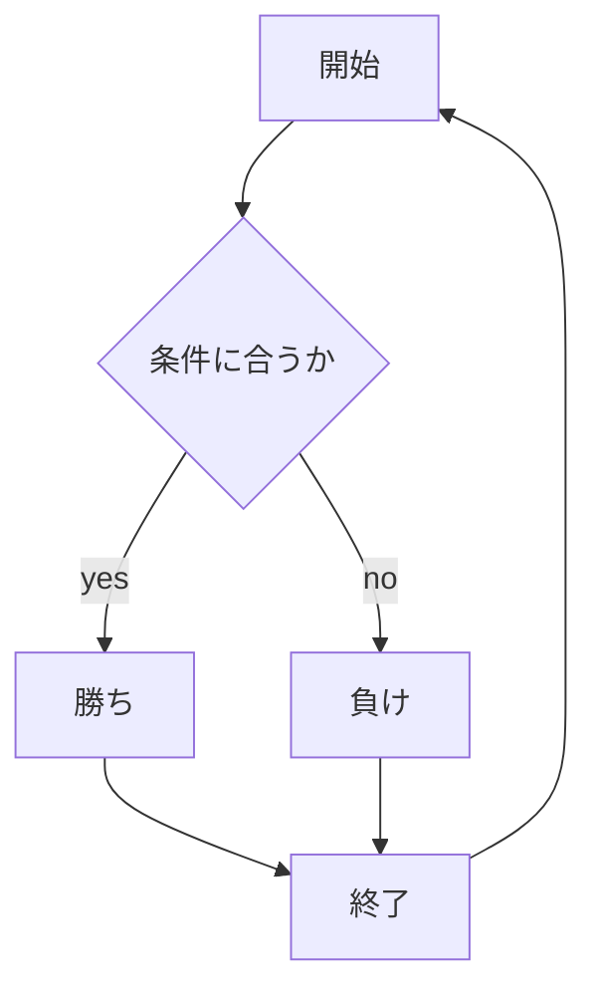
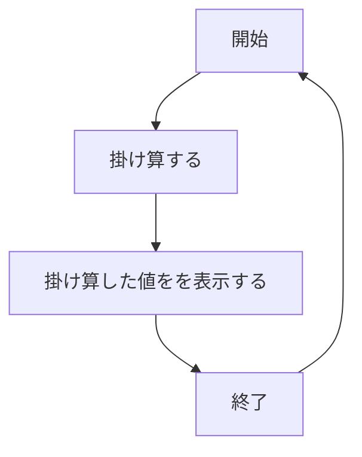
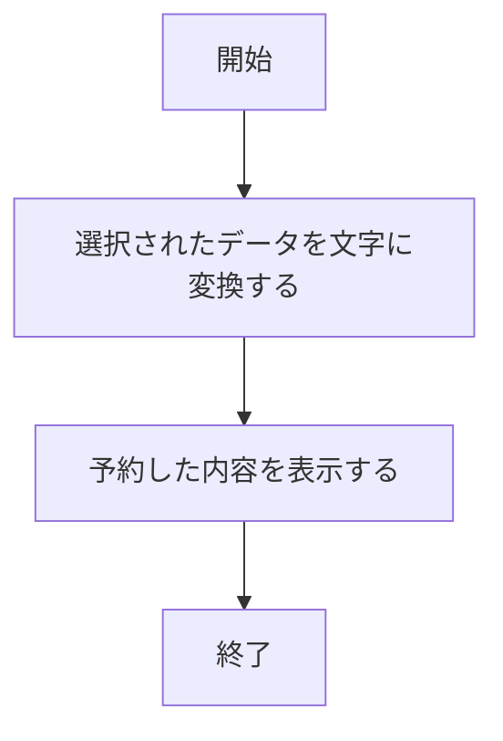

# webpro_06
    2024/10/

##　じゃんけんのプログラムについて
このプログラムはじゃんけんをするプログラムである．
### ファイル一覧
ファイル名|説明
-|-
app5.js|プログラム本体
puclic/janken.html|じゃんけんの開始画面
views/janken.ejs|じゃんけんの入力後の画面

### 使用方法
1. app5.js をターミナルで以下のコードを実行して，起動する
    ```
    node app5.js
    ```
1. Webブラウザで以下のURLにアクセスする
    ```
    localhost:8080/public/janken.html
    ```
1. じゃんけんの手を入力する

### プログラムの機能
1. ページにアクセスする
1. じゃんけんの手を入力後，送信ボタンを押す
1. 勝敗と勝利数と試合数を表示する
1. これを繰り返し行うことができる


## 数値計算のプログラムについて
このプログラムはユーザーが入力した2つ数値を掛け算するプログラムである．
### ファイル一覧
任意の2つの数値を掛け算するページを作成するために以下のファイルが必要である

ファイル名|説明
-|-
app5.js|プログラム本体
puclic/639.html|数値計算の開始画面
views/639.ejs|数値計算の入力後の画面

###　使用方法
1. app5.js をターミナルで以下のコードを実行して，起動する
    ```
    node app5.js
    ```
1. Webブラウザで以下のURLにアクセスする
    ```
    localhost:8080/public/639.html
    ```
1. 数値を2つ入力する

### プログラムの機能
1. ページにアクセスする
1. 数値を入力後，送信ボタンを押す
1. 入力した2つの値をかけた値を表示する
1. これを繰り返し行うことができる


## 予約のプログラムについて
このプログラムはユーザーが入力した個人情報と予約内容を表示するプログラムである．
### ファイル一覧

ファイル名|説明
-|-
app5.js|プログラム本体
puclic/reservation2.html|予約の開始画面
views/reservation2.ejs|予約の入力後の画面

###　使用方法

1. app5.js を起動する
    ```
    node app5.js
    ```
1. Webブラウザで以下のURLにアクセスする
    ```
    localhost:8080/public/reservation2.html
    ```
1. 個人情報と予約内容を選択後，確定ボタンを押す

### プログラムの機能
1. ページにアクセスする
1. 個人情報と予約内容を入力後，確定ボタンを押す
1. 入力した内容を表示する

