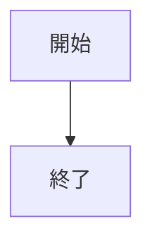
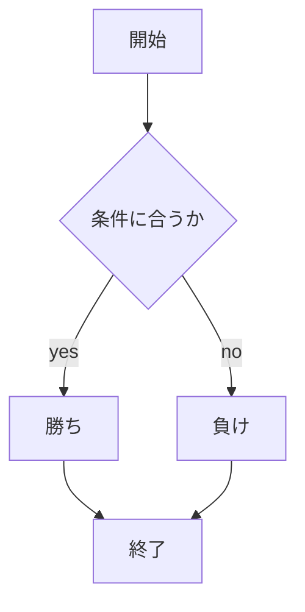

# webpro_06
    2024/10/29
## このプログラムについて
## ファイル一覧

ファイル名|説明
-|-
app.js|プログラム本体
puclic/janken.html|じゃんけんの開始画面

```javascript
console.log( 'Hello' );
```

##　使用方法
1. app5.js を起動する
1. Webブラウザでlocalhost:8080/public/janken.htmlにアクセスする
1. 自分の手を入力する


