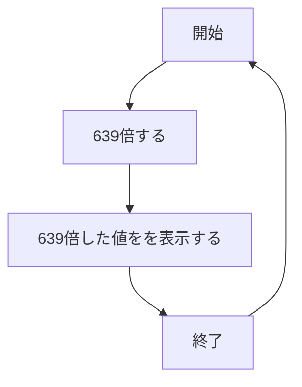

# webpro_06
    2024/10/29
## 数値計算のプログラムについて
このプログラムはユーザーが入力した数値を639倍するプログラムである．
## ファイル一覧

ファイル名|説明
-|-
app5.js|プログラム本体
puclic/639.html|数値計算の開始画面
views/639.ejs|数値計算の入力後の画面

##　使用方法
1. app5.js をターミナルで以下のコードを実行して，起動する
    ```
    node app5.js
    ```
1. Webブラウザで以下のURLにアクセスする
    ```
    localhost:8080/public/639.html
    ```
1. 数値を入力する

## プログラムの機能
1. ページにアクセスする
1. 数値を入力後，送信ボタンを押す
1. 入力した値を639倍した値を表示する
1. これを繰り返し行うことができる


## 予約のプログラムについて
このプログラムはユーザーが入力した個人情報と予約内容を表示するプログラムである．
## ファイル一覧

ファイル名|説明
-|-
app5.js|プログラム本体
puclic/reservation2.html|予約の開始画面
views/reservation2.ejs|予約の入力後の画面

##　使用方法

1. app5.js を起動する
    ```
    node app5.js
    ```
1. Webブラウザで以下のURLにアクセスする
    ```
    localhost:8080/public/reservation2.html
    ```
1. 個人情報と予約内容を選択後，確定ボタンを押す

## プログラムの機能
1. ページにアクセスする
1. 個人情報と予約内容を入力後，確定ボタンを押す
1. 入力した内容を表示する

